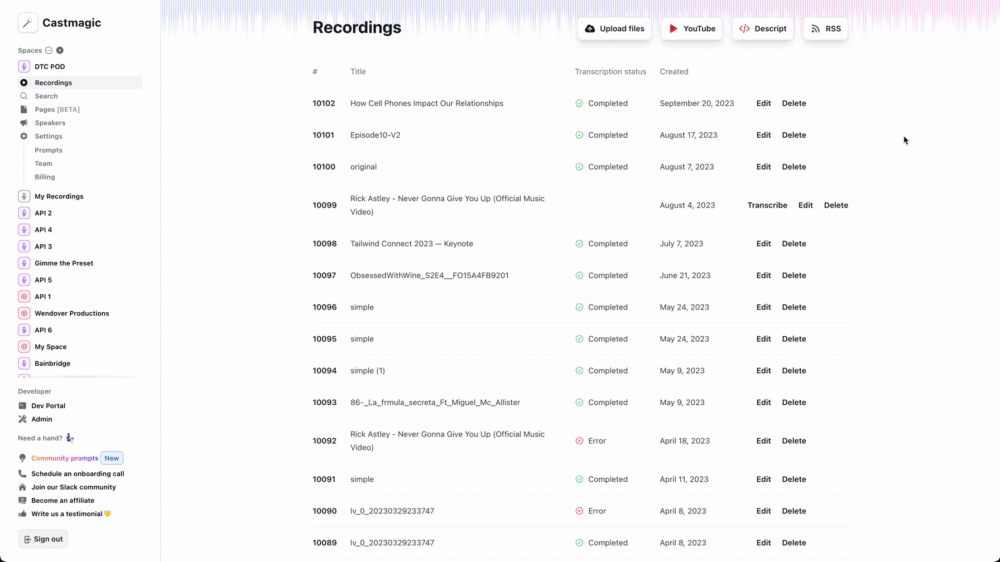

# LiveView Click-to-Component

Adds a click-to-component interaction, which when triggered opens the file and line number associated with the component in your favorite text editor.

The key binding to trigger the interaction is `Option+Click`.



## Installation

The package can be installed by adding `click_to_component` to your list of dependencies in `mix.exs`:

```elixir
def deps do
  [
    {:click_to_component, "~> 0.1.1"}
  ]
end
```

Documentation can be found at <https://hexdocs.pm/click_to_component>.

## Configuration

To enable in dev, add the following to `config/dev.exs`:

```elixir
config :click_to_component, enabled: true
```

You may also customize the command used to open your editor:

```elixir
# This is the default command.
# Use `:path` to substitiute one of the args for the path, in the format `file:line`
config :click_to_component, command: {"code", [".", "--goto", :path]}
```

Make sure that you have LiveView >=0.20.0 installed in your project, and that you have enabled debug annotations:

```elixir
config :phoenix_live_view, debug_heex_annotations: true
```

## Usage

First, add the following code to your `lib/my_app_web.ex` module, in the quoted code in your `live_view` function:

```elixir
def live_view(opts \\ []) do
  quote do
    use Phoenix.LiveView,
      layout: {MyAppWeb.Layouts, :app}

    # Add this line
    unquote(ClickToComponent.hooks())

    # Rest of live_view quoted code...
  end
end
```

Next, render the component code in your `lib/my_app_web/layouts/root.html.heex` layout file:

```html
<body>
  <!-- Rest of layout body markup... -->
  <ClickToComponent.render />
</body>
```

When `click_to_component` is enabled, this will render a JS hook that listens for clicks and renders the component menu on click.

Finally, import and configure the `ClickToComponent` hook in `assets/js/app.js`:

```js
import { ClickToComponent } from "click_to_component";

// Note the function call!
const hooks = {
  ClickToComponent: ClickToComponent(),
};

// Make sure `hooks` is configured in LiveSocket
let liveSocket = new LiveSocket(socketUrl, Socket, {
  hooks,
  params: { _csrf_token: csrfToken },
});
```
